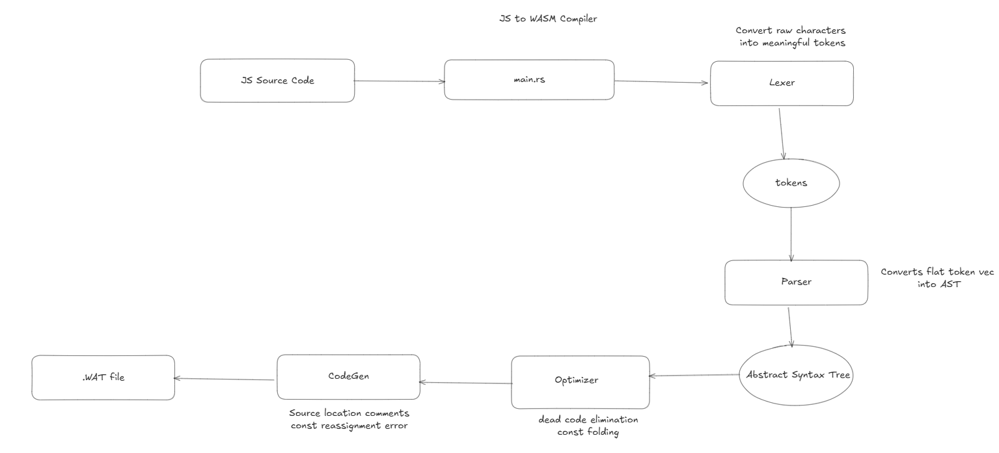

# JS to WASM Compiler

A mini JavaScript to WebAssembly Text Format (.wat) compiler written in Rust. Zero dependencies.

## Supported Language Subset

- Integer arithmetic: `+ - * / % == != < > <= >= !`
- Logical operators: `&&`, `||` (with short-circuit evaluation)
- Variable declarations: `let` and `const` (with immutability enforcement)
- Control flow: `if/else`, `while`, `for`, `break`, `continue`
- Functions with parameters and return values
- Block statements `{ ... }`
- Comments: single-line (`//`) and multi-line (`/* */`)
- All values are 32-bit signed integers (i32)

## Requirements

- Rust (cargo)
- [wasmtime](https://wasmtime.dev/) for running the output

## Build

```bash
make build
```

## Usage

```bash
./target/release/compiler input.js > output.wat

# Or via make
make run FILE=input.js > output.wat
```

## Running the Output

```bash
wasmtime output.wat --invoke _start

# For tail-call optimized code
wasmtime --wasm tail-call output.wat --invoke _start
```

## Testing

Tests are organized by category and can be run individually or in groups.

```bash
# Run all tests
make test

# Run by category
make test-basic           # All basic feature tests
make test-loops           # All loop tests
make test-control-flow    # All break/continue tests
make test-optimizations   # All optimization tests
make test-errors          # All error handling tests
```

### Individual Test Commands

<details>
<summary>Click to expand individual test commands</summary>

```bash
# Basic features
make test-fact
make test-gcd
make test-ack
make test-comments
make test-negative
make test-logical

# Loops
make test-for-basic
make test-for-nested
make test-for-empty-init
make test-for-empty-incr
make test-for-factorial
make test-for-countdown

# Control flow
make test-break-while
make test-break-for
make test-continue-while
make test-continue-for
make test-break-nested
make test-continue-nested

# Optimizations
make test-fold
make test-dead
make test-tail

# Errors
make test-const-error
make test-undefined-var
make test-undefined-func
make test-break-outside
make test-continue-outside
make test-assign-undefined
make test-missing-semi
make test-unexpected-token
make test-unterminated-comment
make test-missing-brace
make test-missing-paren
```

</details>

## Architecture



```
src/
├── main.rs       # CLI entry point
├── error.rs      # Error types and handling
├── lexer.rs      # Tokenization
├── ast.rs        # AST node definitions
├── parser.rs     # Recursive descent parser
├── semantic.rs   # Semantic analysis and validation
├── optimizer.rs  # Constant folding & dead code elimination
└── codegen.rs    # WAT code generation
```

### Pipeline

```
JS Source → Lexer → Tokens → Parser → AST → Semantic Analyzer → Optimizer → CodeGen → WAT
```

## Optimizations

### Constant Folding
Evaluates constant expressions at compile time.

```javascript
let x = 3 + 4 * 2;  // Compiled as: i32.const 11
```

### Negative Number Folding
Folds unary negation of constants into single negative literals.

```javascript
let x = -5;         // Compiled as: i32.const -5
let y = 10 + -3;    // Compiled as: i32.const 7
```

### Dead Code Elimination
Removes unreachable code after `return` statements and eliminates `if(0)` / `while(0)` blocks.

```javascript
function test() {
  return 5;
  let x = 10;  // Eliminated - unreachable
}
```

### Tail Call Elimination
Optimizes recursive calls in tail position using `return_call` instruction, preventing stack overflow for deep recursion.

```javascript
function ack(m, n) {
  if (n == 0) return ack(m - 1, 1);  // Uses return_call instead of call + return
  ...
}
```

### Const Immutability
Enforces `const` variables cannot be reassigned.

```javascript
const x = 10;
x = 20;  // Compiler error: Cannot reassign const variable 'x'
```

## Logical Operators

Supports `&&` (AND) and `||` (OR) with short-circuit evaluation.

```javascript
let a = 5 && 3;     // Result: 3 (both truthy, returns last)
let b = 0 && 3;     // Result: 0 (first is falsy, returns it)
let c = 5 || 3;     // Result: 5 (first is truthy, returns it)
let d = 0 || 3;     // Result: 3 (first is falsy, returns second)
```

## Loop Control Flow

Supports `break` and `continue` statements for loop control.

### Break Statement
Exits the current loop immediately.

```javascript
for (let i = 1; i <= 100; i = i + 1) {
  if (i % 7 == 0) {
    result = i;  // Found first multiple of 7
    break;       // Exit loop
  }
}
```

### Continue Statement
Skips the rest of the current iteration and proceeds to the next.

```javascript
for (let i = 1; i <= 10; i = i + 1) {
  if (i % 3 == 0) {
    continue;  // Skip multiples of 3
  }
  sum = sum + i;
}
```

**Note**: In `for` loops, `continue` properly executes the increment before the next iteration.

## Error Handling

Compiler provides detailed error messages with line numbers for:

### Lexer Errors
- Unexpected characters
- Unterminated block comments

### Parser Errors  
- Missing semicolons, braces, parentheses
- Unexpected tokens
- Invalid syntax

### Semantic Errors
- Undefined variables or functions
- Const variable reassignment
- Break/Continue outside of loops

**Example error output:**
```
Semantic Error at line 5: Cannot reassign const variable 'x'
```

## Test Organization

Tests are organized in categorized folders:

```
tests/
├── basic/          # Core language features
├── loops/          # For loop variations
├── control-flow/   # Break/Continue statements  
├── optimizations/  # Optimization verifications
└── errors/         # Error handling tests
```

## Source Location Comments

Generated WAT includes comments mapping instructions to original JS line numbers for debugging.

```wat
;; line 3
i32.const 5
local.set $x
```

## Test Programs

| Test | Description | Expected |
|------|-------------|----------|
| `factorial.js` | Iterative factorial | 120 |
| `gcd.js` | Euclidean GCD | 6 |
| `ackermann.js` | Recursive Ackermann(3,4) | 125 |
| `const_error.js` | Const reassignment detection | Panic |
| `const_fold.js` | Constant folding verification | 19 |
| `dead_code.js` | Dead code elimination | 5 |
| `negative.js` | Negative number literals | 10 |
| `comments.js` | Single and multi-line comments | 15 |
| `logical.js` | Logical AND/OR operators | 21 |
| `for_loop_basic.js` | For loop - sum 1 to 10 | 55 |
| `for_loop_nested.js` | Nested for loops (5x5 multiplication table) | 225 |
| `for_loop_empty_init.js` | For loop with empty init clause | 10 |
| `for_loop_empty_incr.js` | For loop with empty increment clause | 10 |
| `for_loop_factorial.js` | Factorial using for loop (6!) | 720 |
| `for_loop_countdown.js` | For loop counting down from 10 to 1 | 55 |
| `break_while.js` | Break in while loop - find first divisible by 7 | 7 |
| `break_for.js` | Break in for loop - sum until > 50 | 55 |
| `continue_while.js` | Continue in while loop - sum odd numbers | 25 |
| `continue_for.js` | Continue in for loop - skip multiples of 3 | 37 |
| `break_nested.js` | Break in nested loops - first pair summing to 7 | 25 |
| `continue_nested.js` | Continue in nested loops - skip evens | 12 |

## Future Improvements

### Language Features
- [x] For loops
- [x] Break/Continue statements
- [x] Better error messages with line numbers
- [ ] Floating point numbers (f64)
- [ ] Arrays
- [ ] Strings
- [ ] Objects/Structs 
- [ ] First-class functions
- [ ] Closures

### Architectural Improvements
- [ ] Implement Visitor pattern for AST traversal (reduces code duplication across optimizer and codegen)
- [ ] Introduce proper IR (Intermediate Representation) between AST and WAT generation for better optimization passes

### Fullstack conversion
- [ ] Axum REST API
- [ ] Browser WebAssembly Execution (instantiate and run compiled WASM in browser)
- [ ] Web Playground UI - Monaco editor, compile button, output display 

## License

MIT
